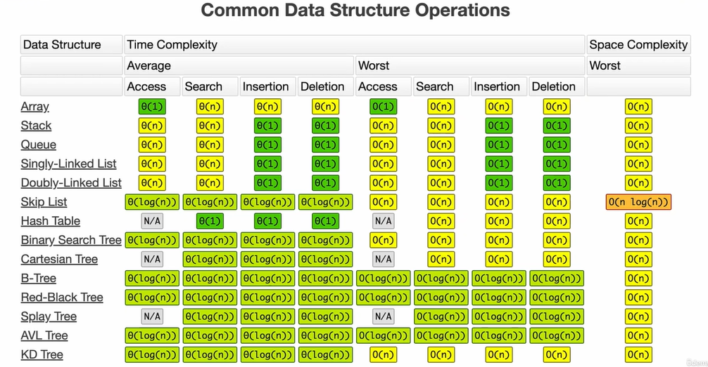
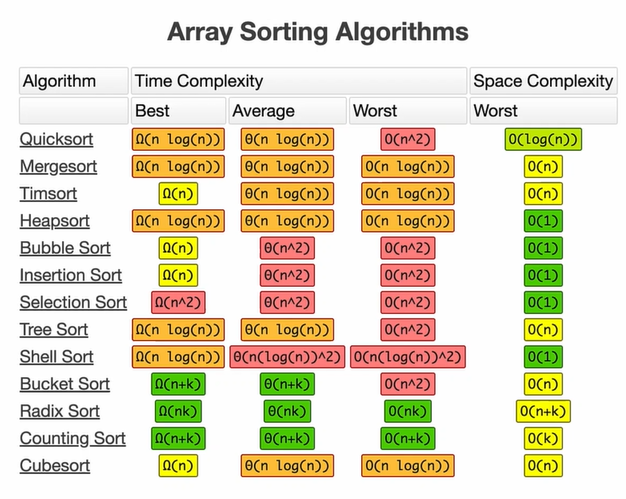

#### *This is to function as a sparknotes of a collection of videos*

# Big O notation
Algos consist of three cases:
- Best case (Omega)
- Middle Cae (Theta)
- Worst Case (O)

Every time we measure the efficiency of an algorithm it is in regards to its worst case, or O notation.
From here is where we get O(n), O(2n), O(logN), O(n^2), where N is the number of operations / cycles of an algo.

1. O(n)
    - Always linear y=x equation
2. O(2n)
    - Don't fully understand the "Drop Constants" concept, to the best of my understanding it means that anything that happens n + n times (2n) in this case should be deemed at O(n) effiencicy. This doesn't track very well with my previous understanding as all of the operations should happen within the same loop in order to classify it as O(n)
3. O(n^2)
    - Anytime there are nested loops, its going to be n^2. (n*n)
    - Doesn't matter how many nested loops, this is the notation
    - (Drop Non-Dominates)
4. O(1)
    - Constant time, no matter how many items, it takes one operation to solve (most efficient)
5. O(LogN)
    - Has to have sorted data
    - Close Binary search (might be exactly binary search)
    - Divide and conquer, take data, split it, determine where you fall against your target, discard the leftover data & repeat.
6. O(n log n)
    - Most efficient you can make a non numeric sorting algo
<hr>

### NOTE:
```js
    function logItems(a,b){
        for (let i = 0, i < a; i++){
            console.log(i);
        }
        for (let j = 0, j < b; j++){
            console.log(j);
        }
    }
```
Does NOT simplify down to O(n) notation under drop constant rule;
goes to O(a+b).
If nested O(a*b)
<hr>

#### Array Cheat Sheet:
- on the tail end, push & pop are O(1)
- on the head due to re-indexing they (+splice) are O(n)
- search by value = O(n)
- search by index = O(1)

### Wrapup
if n = 100
O(1) = 1            - Constant
O(logn) = 7         - Divide and Conquer
O(n) = 100          - Proportional
O(n^2) = 10,000     - Loop within a loop

if n = 100
O(1) = 1
O(logn) = 10
O(n) = 1000
O(n^2) = 1,000,000

[BigO Cheat Sheet](https://www.bigocheatsheet.com/)



